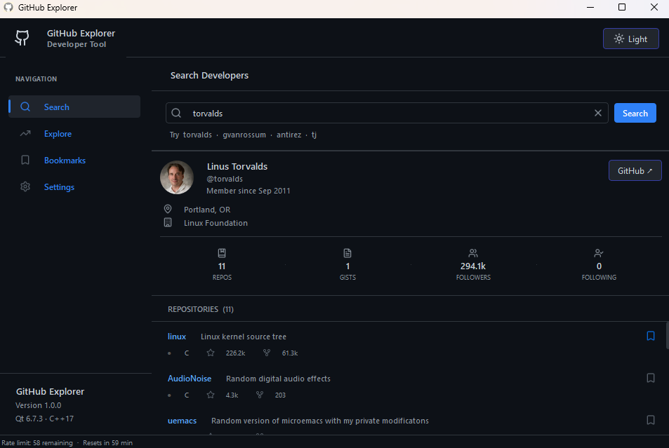
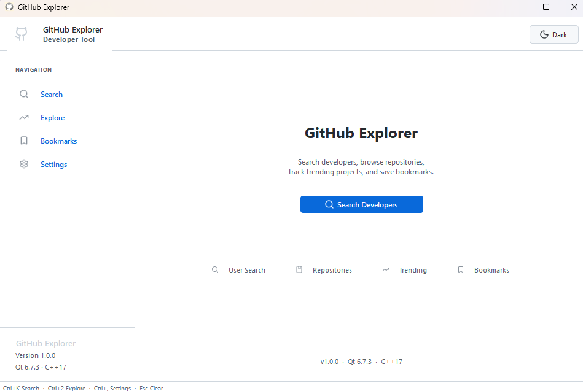
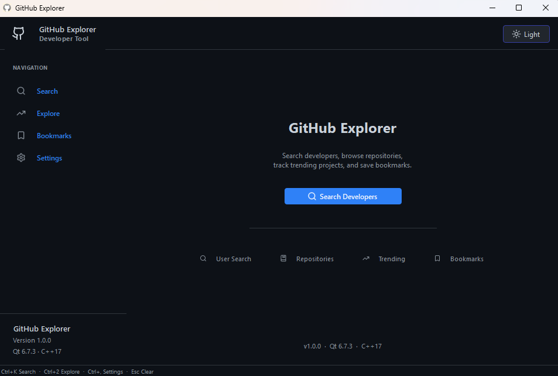
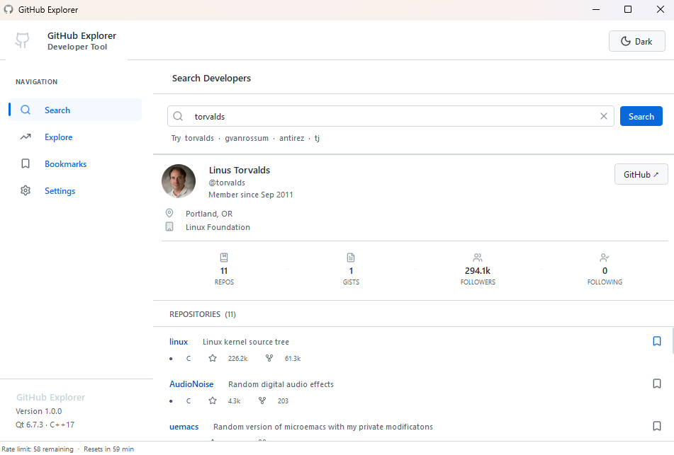
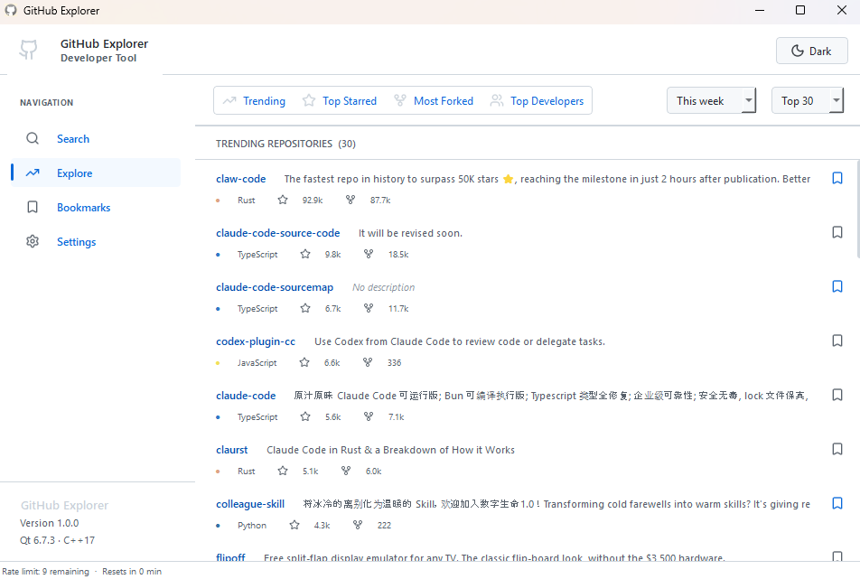
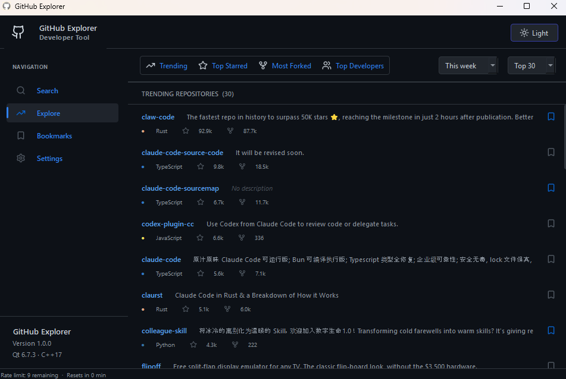
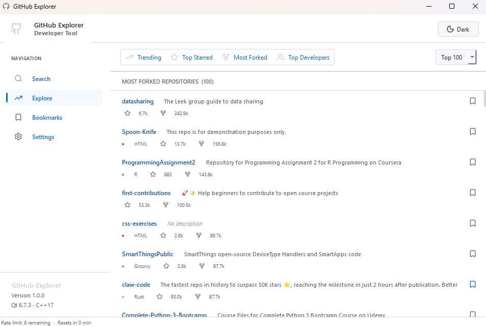
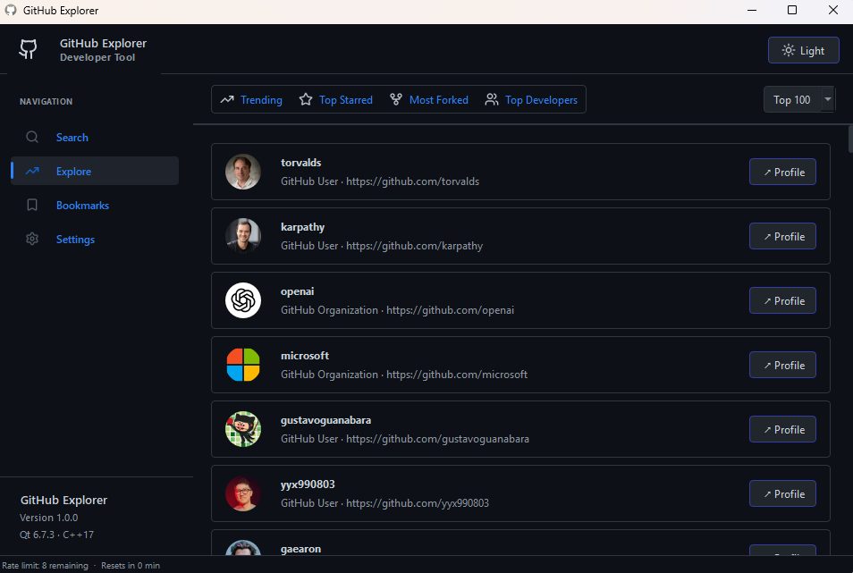
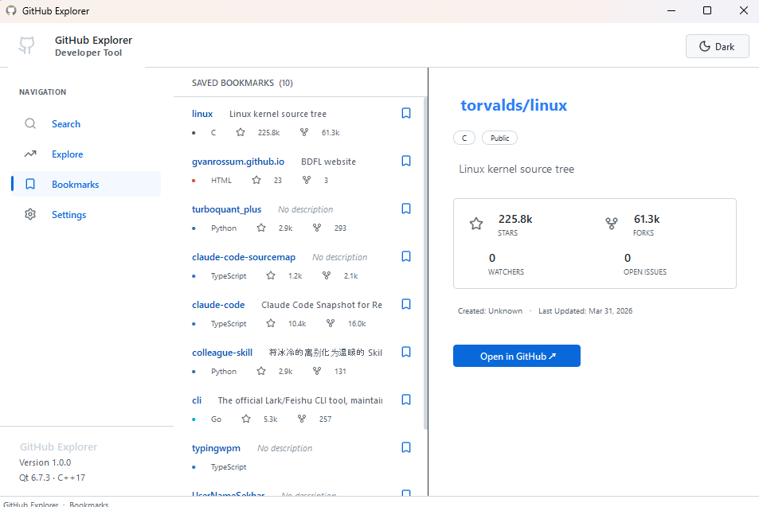
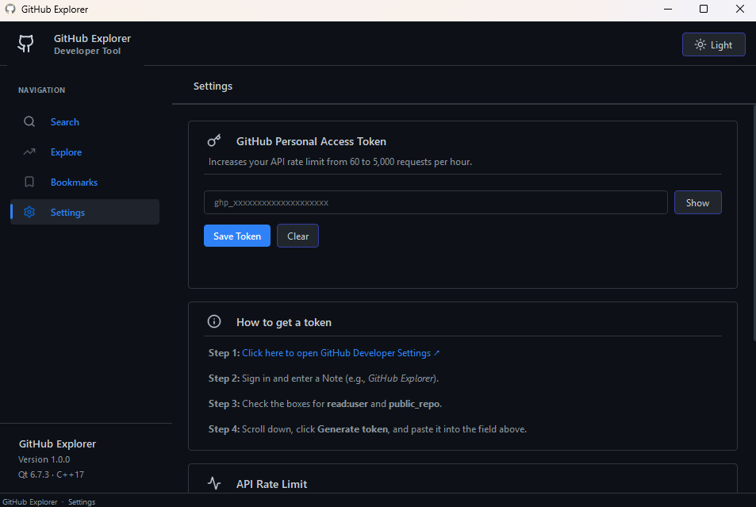

  
  <h3 align="center">GitHub Explorer</h3>
  

    A lightning-fast, native desktop client for exploring GitHub.
     
    <a href="[https://github.com/YOUR_USERNAME/github-explorer-qt/releases/latest](https://github.com/YOUR_USERNAME/github-explorer-qt/releases/latest)"><strong>Download for Windows »</strong></a>
  

## 🌌 About The Project

GitHub Explorer is a premium, native desktop application designed to interact with the GitHub REST API. Built entirely in C++ and Qt, it aims to provide a fast, memory-efficient, and visually stunning alternative to web-based exploration. 

### ✨ Key Features
* **Lightning Fast Search:** Instantly find developers, view their stats, and explore their repositories.
* **Explore Dashboard:** Discover trending projects, most-starred repositories, most-forked projects, and top developers with advanced time and limit filters.
* **Native Bookmarking:** Save your favorite repositories locally using a robust SQLite/Settings backend.
* **Premium UI/UX:** Features a fully responsive, master-detail layout with fluid animations and dynamic Light/Dark mode toggling.
* **API Authentication:** Support for GitHub Personal Access Tokens to securely increase rate limits from 60 to 5,000 requests per hour.

## 🛠️ Built With
* **C++17** - Core application logic and memory management.
* **Qt 6.7** - UI framework, networking (`QNetworkAccessManager`), and concurrent processing.
* **Qt Style Sheets (QSS)** - Completely custom, CSS-driven UI components.
* **Lucide Icons** - Scalable, theme-aware vector graphics.

## 🚀 Getting Started

### Prerequisites
To compile this project from source, you will need:
* Qt 6.5 or higher (with the Qt Network module)
* CMake or qmake
* A C++17 compatible compiler (MinGW / MSVC / Clang)

### Installation
1. Clone the repo:
    git clone [https://github.com/sekhar-dev79/github-explorer-qt.git](https://github.com/sekhar-dev79/github-explorer-qt.git)

2. Open `GitHubExplorer.pro` in Qt Creator.
3. Build in Release mode and Run!

## 📸 Showcase

Experience a premium native UI with seamless switching between Light and Dark modes.

| Light Theme | Dark Theme |
| :---: | :---: |
| **Search & Developer Profiles** |
|  |  |
| **Explore Dashboard (Trending & Top)** |
|  |  |
| **Repository Details & Stats** |
|  |  |
| **Local Bookmarks** |
|  |  |
| **Settings & API Authentication** |
|  |  |

## 📄 License
Distributed under the MIT License. See `LICENSE` for more information.
